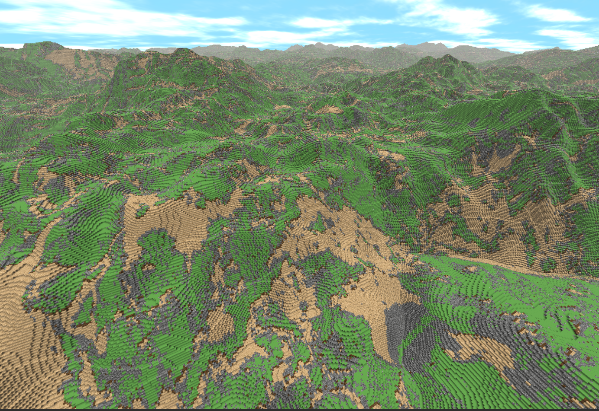
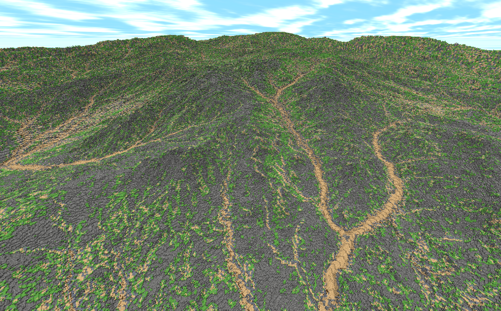

# Oubinity Documentation

This document aims to provide an overview of the engine and to describe core algorithms and techniques used. It's not supposed to be a tutorial, but it shouldn't have a high barrier of entry either. Assumption is that the reader has knowledge of any programming language, preferably C++ and a basic knowledge of OpenGL or similar graphics API. Engine is work in progress. There are known bugs and components that need to be redesigned. 

### Contents
1. [Overview](#overview)
    * [Usage Cheatsheet](#usage-cheatsheet)
    * [Introduction](#introduction---what-is-a-voxel-engine)
    * [World generation](#world-generation)
    * [Level of Detail](#level-of-detail)
2. [Terrain Generation](#terraingeneration)
    * [Chunk Preloaded & Procedural generation](#chunk-preloaded--procedural-generation)
    * [Trees](#tree-generation)
    * [Sky](#sky)
    * [Water](#water)
3. [Meshing](#meshing)
    * [Meshing Overview](#introduction)
    * [Binary greedy meshing](#binary-greedy-meshing)
4. [Rendering](#rendering)
    * [Vertexpool, gl Multi-Draw and persistent mapped buffers](#zonevertexpool)
    * [Passing mesh data to GPU pipeline](#passing-mesh-data-to-gpu-pipeline)
5. [Adding and destroying blocks](#adding-and-destroying-blocks)

### Overview

#### Usage Cheatsheet
This engine uses a few toggle modes that can be enabled in `src/Settings.h`
Most important are:
```c++
// 1 - enabled, 0 - disabled
// Enable reading height of the terrain from external image files
#define SETTING_USE_PRELOADED_HEIGHTMAP 1
// Enable reading voxel types of the terrain from external image files
#define SETTING_USE_PRELOADED_COLORMAP 1
// Blend external image files data with procedural generation.
#define SETTING_USE_HEIGHTMAP_BLENDING 1

// Enable trees
#define SETTING_TREES_ENABLED 1
// Read tree positions data from external image file
#define SETTING_USE_PRELOADED_TREEMAP 1

// Horizontal and Vertical render distances
static constexpr int MAX_RENDERED_CHUNKS_IN_XZ_AXIS = 128;
static constexpr int MAX_RENDERED_CHUNKS_IN_Y_AXIS = 16;

// Path to maps
constexpr char PRELOADED_HEIGHTMAP[] = "assets/mountain_lake_heightmap.png";
constexpr char PRELOADED_COLORMAP[] = "assets/mountain_lake_colormap.png";
constexpr char PRELOADED_TREEMAP[] = "assets/treemap.png";
```

#### Introduction - what is a Voxel Engine
Oubinity is a voxel engine. Voxel is a 3D cube located on a three-dimnesional grid and can be seen as a 3D counterpart to a 2D pixel. Every object on the world scene is composed of voxels and each voxel is interactable, for example it can be destroyed. This opens a possibility for a player to interact and modify everything that is located on a world scene. Main focus of this engine is on terrain.

Voxels stack


Voxels amount in the world scene scale up cubically and voxels count is in billions or higher. Dealing with a large amounts of voxel data is one of the main problems to solve in voxel engine development. Storing or rendering all of the voxels would make PC quickly run out of CPU and memory resources. One of the strategies is to identify what data does not need to be stored and which part of the world scene does not need to be rendered. To illustrate, voxels that were not edited by a player do not need to be stored. World fragments that cannot be seen by a player do not need to be rendered. To manage this, voxels are grouped into chunks. Chunk is defined as 32x32x32 cube that is composed of voxels. Representing world as chunks opens possibilities for performance optimizations and is also convenient in general.

World generation can be divided conceptually into three phases:

1. Terrain chunk generation: first step to create a chunk is to determine voxel type (sand, air, stone) for each voxel in a chunk. 

2. Chunk meshing:  
Voxel is the smallest interactable unit from the player point of view, but it is not the smallest unit to render overall. Voxels are composed of faces (quads) and each voxel has 6 faces (quads). Not every voxel or face is visible to a camera, thus not every face needs to be in mesh. Mesh is a collection of faces (quads) to render on a screen. Meshing is a phase that takes chunk's voxels and produces an array of faces that engine considers as visible.

3. Mesh rendering: a phase when mesh is passed to GPU via OpenGL API calls, to be rendered. Mesh is passed as an input to GPUs render pipeline. 
 
These three phases are main building blocks of chunk gneration pipeline and they will be described in greater detail in next sections. Each phase has a great potential to be optimized.

---
#### World generation

##### Overview

Ideas presented above, in the introductory section have their representation in the engine.
World scene generation and updates are managed by a `MasterRenderer` class. `MasterRenderer` orchestrates generation and updates of chunks, water and sky. Most of the logic in the engine is related to chunks and world is splitted into them. `ChunkRenderer` is a `MasterRenderer`'s component that handles world chunk generation and handles chunk updates. `ChunkRenderer` actions are splitted into two parts: world initial loading and world updates. All visible chunks that are in the render distance are loaded in a world loading phase. Update part is done when camera moves far enough that new chunks are needed to be generated or old ones are needed to be deleted. Initial loading and updates are divided into smaller tasks. Tasks are considered to be main building blocks of chunk scene management and a [thread pool](https://github.com/bshoshany/thread-pool) is used to manage tasks. Threads that are used by [thread pool](https://github.com/bshoshany/thread-pool) are called generation threads. On those threads chunks can be created, have their terrain generated, can be meshed or can be marked to be deleted. However there is no rendering done on generation threads. OpenGL API calls are executed on a render thread.


 When the task is completed its result is moved to a [lock-free concurrent queue](https://github.com/cameron314/concurrentqueue). This queue is shared between multiple generation threads and one render thread, which fetches items from the queue and renders them.

Chunks have padding. Padding in that context means that chunks have overlapping blocks with their neighboring chunks. Each chunk stores additional blocks it borders with. This allows to mesh chunk independently from other chunks and makes multithreading easier, because each chunk can be generated without any dependency on other chunks. Structures which extend over several chunks (e.g. trees) are generated in an additional dedicated phase.


Example image above - Blue chunk borders with four purple chunks. We add purple neighbor blocks that are on chunk borders to blue chunk. 

##### Loading phase
Each chunk in the render distance is loaded. If trees are enabled, they will be generated in a separate phase that happens after initial chunk generation tasks are finished.

##### Update phase
When the camera moves, world scene needs to have additional chunks generated and some of the chunks removed. Additionally some chunks may need level of detail update. `traverseScene` method scans for chunks that need updates. To make this more efficient only world borders are checked and that check is only done when camera has moved in a specific direction.


See example image above - camera has moved one chunk to the right, which generated `WindowMovementDirection` with movement to the right. Leftmost chunks will be deleted and new row will be added to the right. Camera position will be updated.

Chunks that are in the render distance are stored in a `ChunkSlidingWindow` (circular buffer). Those chunks are only a slice of the whole world scene and are updated in a scrollable manner, when the camera moves. `ChunkSlidingWindow` is an array of a fixed size, where chunks are stored relative to camera's position. When the camera moves, we delete old chunks and add new ones into their places. Other elements do not need to be repositioned. This allows for a fast `O(1)` lookups, fast inserts and is convenient in multithreading scenarios, because the underlying structure is a static array.

##### Trees
Trees introduce additional complexity - they can be placed across chunk boundaries and be part of multiple chunks at once. 


Example image above - one tree spreads across four chunks. Tree blocks actually belong to the chunk they are in, so part of the tree is in `Chunk1`, part of it in `Chunk2`, `Chunk3` and `Chunk4`. If `Chunk2` and `Chunk4` were not present, rightmost part of the tree would be cut.

We need to ensure that trees which spread over a few chunks will be fully generated and rendered. The proposed solution is to place trees only when all the chunks on which the tree will be located are already generated. To make things easier tree generation is done in a separate phase, after chunk generation finished. Furthermore tree generation has it's own chunk padding margin, to ensure that tree will not go out of the world borders. That strategy makes it easier to ensure that trees will be fully generated and the generation will be done once.


On the example image above - Trees can be placed only in green area. A proper ordering of tasks during update phase must be preserved. Chunk generation tasks need to be executed before tree generation tasks. Similarly to chunk generation, tree generation also consists of terrain generation, meshing and rendering. Tree generation is also a task in a thread pool.


Example image above - world update when trees are enabled. Notice that tree update needs more than one row to be updated. This is because one tree can spread itself over multiple chunks. 

Next sections will cover chunk generation steps (terrain generation, meshing and rendering) in a more detail. Terrain generation is a hybrid between loading data from texture maps and procedural generation. Binary Greedy Meshing is a meshing algorithm of choice. OpenGL is used as a graphics backend. A custom memory allocator in a persistent mapped buffer is used to allocate chunks data on GPU, to reduce draw calls by utilizing OpenGL's multidraw API (`glMultiDrawArraysIndirectCount`).


#### Level of Detail

Level of Detail (LoD for short) refers to the complexity of the generated models. Models that are further away from the camera occupy less pixels on the display screen. Those models do not need to be rendered in full detail, because with them being far away it would be hard to see those details and distinguish from less detailed replacements anyway. Rendering less detailed models mean that we will have smaller meshes and smaller polygons (triangles) count. 


Example image above - Level of Detail transitions (from more details to less) were marked by red and blue rectangles. For demonstration purposes LoD transitions are very close to the camera, to make it visible. Usually we don't want LoD to be very noticeable.

In this engine we mostly deal with chunk's LoD. Chunks with fewer details have less amount of blocks, but their blocks are larger in size. For example, assume that chunk size is equal to 32 and ignore chunk padding.

Chunk levels are done as follows:
Level 1: 32 blocks, each of size 1x1x1
Level 2: 16 blocks, each of size 2x2x2
.
.
Level 5: 1 blocks of size 32x32x32

Levels are chosen based on distance between camera and a chunk, it is grid based


One of the drawbacks of a current implementation is that each lod level is fully generated on CPU. When lod level changes, chunk is deleted and new one with different LoD is generated - this is slow and will be reworked. Additionally Quadtree or Octree may be considered instead of grid based system.

### TerrainGeneration

#### Chunk Preloaded & Procedural generation
Terrain generation is a step done when chunk instance is already created and level of detail is chosen. `TerrainGenerator` is a main class. It has two major components: `ProceduralGenerator` and `PreloadedGenerator`. 
In this step voxel types are to be determined for each visible voxel in each visible chunk. Terrain generation pipeline is a hybrid between procedural generation and preloaded generation.
* Procedural generation is a method of calculating voxel types algorithmically, at runtime. Main building blocks are chosen from a family of  noise algorithms. [FastNoise2](https://github.com/Auburn/FastNoise2) library is used.
* Preloaded generation is a term used in this engine to describe terrain generation based on reading terrain data from maps stored as image files. 

Terrain generation consists of four phases:
1. Shaping phase, where shape of the terrain is determined. In other words this phase checks if voxel type should be `air` or should be a solid (e.g. `stone`). A surface is formed and is stored in a heightmap, where each `xz` coordinate of a chunk's stores `y` height of a voxel that belongs to the surface. Voxels that are on the surface are the most important. There is air layer above the surface and underground layer beneath. Voxels and chunks that are in air layer do not need to be stored and can be skipped during computations. The same applies in general for an underground layer. Voxels that are occluded by surface voxels and cannot be visible do not need to be stored in principle.
2. Layering phase, where block types are determined.
3. Decoration phase, where trees locations are determined.
4. Decoration phase, where trees are generated procedurally.

First phase can be either purely procedural, purely preloaded or a blended hybrid. Second and third phase can be either preloaded or procedural. Tree generation is procedural only and is optional. Generation modes can be chosen in `Settings` class and they are applied at compile time.


Above, a fully preloaded example. The shape of the terrain is determined via a preloaded heightmap, which is parsed, chunked and then optionally scaled (bilinear interpolation). Next, colormap is parsed, chunked and optionally scaled. A function is used to map a color to a closest matching block type.



In this example above shape of the terrain (heightmap) is calculated procedurally, while colormap is preloaded. The world is infinite and fog is enabled.

Preloaded generation allows to create maps in third party tools and does not require any knowledge of the engine. It also offers fine-grained control over the terrain and to use more costly algorithms, like erosion, because it will be baked into colormap. Texture map generation itself does not have to be fast because it will be calculated once, will not be done at runtime and will be saved into PNG file after. Reading from PNG file that is already loaded to RAM is fast and cheap. 

Determining height and voxel types distribution is not the only way to change appearence of the terrain. Different voxel palette can be chosen to change how the terrain looks. In the example below, the same heightmap and colormap are used, but with different voxel type palette.




There are limitations to loading terrain from texture maps as well. Image files are finite, which means that either world will be finite or the same world will be repeated multiple times. A single texture map is not sufficient to represent an infinite world. Texture maps are mixed with procedural noise for a better outcome.
In some way texture maps are a hardcoded layered procedural noise. Preloaded and procedural noises can be represented in a graph form, where single procedural noise or preloaded texture map is a node. Nodes can be combined together in various ways.


Above, a blended heightmap terrain, preloaded texture acts as a node and is composed with another procedural simplex noise node. This gives infinite terrain and also maintains preloaded node properties, while offering varied, not so repeating world.


World scenes can be bigger. Here's an example of 768x8x768 chunks in the render distance with camera in the middle. World shape is purely procedural in this example. A single simplex node was used. Repetitions in the terrain are visible. One single noise node is often not enough to get a varied terrain.


#### Tree generation

Tree generation can be divided into:
1. Determining tree locations
2. Tree generation algorithms

##### Determining tree locations
Tree locations can be determined based on a preloaded tree map or from procedurally generated noise. There are some additional rules, for example tree has to be above water and has to be placed on grass block. 


##### Tree generation
Trees are generated procedurally. Each generated tree can be unique. A batch of trees is generated during the initialization and is cached. During tree placement tree type is chosen from that cache with a uniform distribution.
A technique from [Modeling Trees with a Space Colonization Algorithm](http://algorithmicbotany.org/papers/colonization.egwnp2007.large.pdf) paper was used to generate trees. This algorithm simulates tree growth by creating a set of 'attraction points' located in a 3D space. Tree skeleton is created iteratively. In each iteration, an attraction point may influence the tree node that is closest to it, making tree branches grow towards attraction points. Attraction points have their kill distance. Attraction point is removed (killed) when there is at least one tree node within kill distance threshold. There are additional settings and rules that allow for more variety. Source code can be found in `BranchGenerator` class.

This algorithm outputs an array of branches. A branch has two nodes and each node stores its position vector. Branches are voxelized by using a technique from [A Fast Voxel Traversal Algorithm for Ray Tracing](http://www.cs.yorku.ca/~amana/research/grid.pdf) paper. Source code can be found in `Tree` class


#### Water

Water is handled by `WaterRenderer`. Water is implemented in a shaders: `waterVertex`, `waterFragment` as a flat transparent plane with water texture.


#### Sky

Sky and clouds implementation is based on https://iquilezles.org/articles/dynclouds/. Sky rendering is handled by `SkyRenderer`. Sky is mapped onto a quad plane and the main part is handled in a fragment shader `skyFragment`


### Meshing

#### Introduction
Meshing is a phase that is done after chunk terrain is generated. It takes array of voxel types on input and produces visible faces (quads) as an output. Meshing is done per chunk. It is generally worth to reduce faces amount on a world scene, as it reduces memory footprint and allows GPU to render less data, which reduces render times. The idea is to reduce faces, without changing the scene from camera's perspective. This can be illustrated by looking at a single chunk:


In this example every face possible is present in a chunk mesh. This can be seen because of wireframe mode. Most of those faces would not be visible to a camera, if wireframe mode was not used. One of optimizations is to cull out (skip) interior faces that are occluded by their neighbors. It is possible, because each voxel type in a chunk is already known, it is given as an input. 


Second example illustrates this. Faces that were inside chunk are not meshed nor rendered at all. This improves the performance, as it reduces faces amount from `O(n^3)` to `O(n^2)`. Changes would be unnoticeable from the camera point of view, if not for wireframe.

A working example from the very early version of this engine:
```cpp
void Chunk::prepareChunkMesh() {
	m_mesh_vertex_positions.clear();
	m_mesh_textures_positions.clear();
	m_mesh_shading_positions.clear();
	int block;
	for (int local_x = 0; local_x < CHUNK_SIZE_X; local_x++) {
		for (int local_y = 0; local_y < CHUNK_SIZE_Y; local_y++) {
			for (int local_z = 0; local_z < CHUNK_SIZE_Z; local_z++) {
				block = getBlockId(glm::ivec3(local_x, local_y, local_z));
				if (block != block_id::AIR)
					addVisibleFaces(glm::ivec3(local_x, local_y, local_z));
			}
		}
	}
}

void Chunk::addVisibleFaces(glm::ivec3 block_pos) {
	int x = block_pos.x, y = block_pos.y, z = block_pos.z;

	if (!isFaceVisible(glm::ivec3(x + 1, y, z))) addFace(block_mesh::RIGHT,  glm::ivec3(x, y, z));
	if (!isFaceVisible(glm::ivec3(x - 1, y, z))) addFace(block_mesh::LEFT,   glm::ivec3(x, y, z));
	if (!isFaceVisible(glm::ivec3(x, y + 1, z))) addFace(block_mesh::TOP,	 glm::ivec3(x, y, z));
	if (!isFaceVisible(glm::ivec3(x, y - 1, z))) addFace(block_mesh::BOTTOM, glm::ivec3(x, y, z));
	if (!isFaceVisible(glm::ivec3(x, y, z + 1))) addFace(block_mesh::FRONT,	 glm::ivec3(x, y, z));
	if (!isFaceVisible(glm::ivec3(x, y, z - 1))) addFace(block_mesh::BACK,	 glm::ivec3(x, y, z));
}

bool Chunk::isFaceVisible(glm::ivec3 block_pos) {
	int x = block_pos.x, y = block_pos.y, z = block_pos.z;
	// out of bounds check for example...
	if (x < 0 || y < 0 || z < 0) return false; // ...x - 1 = -1 < 0
	if (x >= CHUNK_SIZE_X || y >= CHUNK_SIZE_Y || z >= CHUNK_SIZE_Z) return false; // ...x + 1 = 16 > 15
	return m_blocks[x][y][z] != block_id::AIR;
}
```

This method is still quite naive. Next method, that is binary greedy meshing is way better, but it takes a leap to understand. To give some credit first, images of a wireframed chunk were taken from this article: https://0fps.net/2012/06/30/meshing-in-a-minecraft-game/. 
This article actually covers greedy meshing as well, but it's not the one used in this engine. It's quite different. The one used in this engine comes from: https://github.com/cgerikj/binary-greedy-meshing/tree/v1.0.0. Version 1.0.0 with baked ambient occlussion is used.

#### Binary Greedy Meshing

Binary greedy meshing combines faces of the same orientation (top, left) and type (sand, stone) that lie on the same plane into a single quad using a few bitwise operations. It has two main phases:
1. Binary meshing (binary face culling)
2. Greedy meshing

##### Binary meshing:
This part of the algorithm determines if a face should be visible. An array of chunk's voxel types is given as an input. At first each face of solid voxel type (i.e. not air) is considered visible. Faces in chunk interior will be culled out. The idea is to group faces in a way that allows to determine visibility not just for one face, but for a whole column simultaneously in one or few bitwise operations.

First, we need to store faces in columns. We have three axises (x, y, z), so we have three column types, one per axis.


This is Y axis column. It has up to 32 top and 32 bottom faces.

Each column is given on a plane. This mapping goes as follows:


XZ plane stores Y axis columns. There are 32 Y axis columns per chunk. Y column stores top and bottom faces.

ZY plane stores X axis columns. There are 32 X axis columns per chunk. X column stores left and right faces.

XY plane stores Z axis columns. There are 32 Z axis columns per chunk. Z column stores front and back faces.

Each column stores two types of faces (e.g. top and bottom faces):


There are 32 slots for Top faces and 32 slots for Bottom faces in Y column (also - column has CHUNK_SIZE + 1 slots). 
Top and bottom faces overlap with each other. First and last face does not overlap with faces inside a chunk, but they may overlap with faces that are present in chunk neighbors adjacent to them. We need to know those adjacent faces type to determine border slots visibility.
We solve this by adding neighbor voxels padding to a chunk. In other words, instead of storing 32x32x32 chunks, we store 34x34x34 chunks, where additional voxels are taken from neighboring chunks.


Blue 32x32x32 chunk now stores it's neighbor chunks voxels, that it borders with.
Blue chunk size is now (32+2)x(32+2)x(32+2)

Axis columns are stored in a flat (1D) array. We iterate over chunk voxels with padding already applied. `padded_blocks_presence_cache` is an array of voxels that is extended by padding. We check if voxel type is solid: `padded_blocks_presence_cache[bit_pos]`. If it is we mark faces as visible in their respective slots in their columns. To summarize, in this code snippet below, we take an array of voxels and store their faces in columns. 
```cpp
    
     /* 
     CS_P == chunk size with padding == 34
     CS_P2 == CS_P * CS_P
     axis cols store data in flat 1D array:
     axis 0    axis 1  axis 2
     [0, CS_P2|2*CS_P2|3*CS_P2]
     
    axis 0: axis_cols[0, CS_P2) - iterating over xz plane in y direction, top and bottom faces
    axis 1: axis_cols[CS_P2, 2CS_P2) - iterating over zy plane in x direction, left and right faces
    axis 2: axis_cols[2CS_P2, 3CS_P2) - iterating over xy plane in z direction, front and back faces */
	for (uint64_t y = 0; y < CS_P; y++) { 
		for (uint64_t x = 0; x < CS_P; x++) {
			uint64_t zb = 0;
			for (uint64_t z = 0; z < CS_P; z++) {
				if (padded_blocks_presence_cache[bit_pos]) {
					axis_cols[(CS_P * z) + x] |= 1ULL << y;
					axis_cols[CS_P2 + (y * CS_P) + z] |= 1ULL << x;
					zb |= 1ULL << z;
				}
				bit_pos++;
			}
			axis_cols[(CS_P2 * 2) + (x * CS_P) + y] = zb;
		}
	}
```

We can now represent a chunk column as a binary word, for example:
`uint64_t c = 0b00..0010100010111101101101011011101111`
`1` means that face is of solid type (is present), `0` means that it is air (is not present).

We will now take that binary columns representation and apply bitwise operations to determine if face should be visible.
Let's take any binary word that represents a column.

`uint64_t c_1 = 0b00..001101`

We shift column to 'right' direction, this gives us faces that have solid to their 'left':

`uint64_t c_2 = c_1 >> 1 = 0b00..000110`

We negate previous result, this gives us faces that have air to their 'left'

`uint64_t c_3 = ~c_2 = 0b11..111001`

We apply AND operation on first and third result, that gives us faces that have air to their `left` and are solid. In other words that gives us faces that should be visible.

`uint64_t c_4 = c_1 & c_3 = 0b00..001001`

'left' and 'right' phrases were used, depending on column and face type it's either 'left', 'right', 'up', 'down', 'front', 'back', but the method is the same, up to shift direction.

```cpp
	/*
	 col_face_masks stores data in flat 1D array:
     
        axis 0  axis 1 axis 2
     [0, 2CS_P2|4CS_P2|6CS_P2]
     
	axis 0: Top and Bottom faces
	  col[0, CS_P2)
	  col_face_masks[0, CS_P2)
	  col_face_masks[CS_P2, 2CS_P2)
	axis 1: Left and Right faces
	  col[CS_P2, 2CS_P2)
          col_face_masks[2CS_P2, 3CS_P2)
	  col_face_masks[3CS_P2, 4CS_P2)
	axis 2: Front and Back faces
	  col[2CS_P2, 3CS_P2)
	  col_face_masks[4CS_P2, 5CS_P2)
	  col_face_masks[5CS_P2, 6CS_P2)
	*/
	for (int axis = 0; axis <= 2; axis++) {
		for (int i = 0; i < CS_P2; i++) {
			uint64_t col = axis_cols[(CS_P2 * axis) + i];
			m_mesh.col_face_masks[(CS_P2 * (axis * 2)) + i] = col & ~((col >> 1) | (1ULL << CS_LAST_BIT));
			m_mesh.col_face_masks[(CS_P2 * (axis * 2 + 1)) + i] = col & ~((col << 1) | 1ULL);
		}
	}

```

That was binary meshing part of the algorithm. Faces that should be visible are stored in columns and they could be collected and rendered as they are. This part can be used as a standalone algorithm: TODO LINK. Greedy meshing, which is next part, takes `col_face_masks` as an input and merges faces of the same type into bigger quads.

This part of the algorithm can be used as in a standalone version. Standalone version can be found [here](https://github.com/nlins8224/Oubinity/blob/78bb0ab6cedb1ed23b5ed8315130610c13a35398/Minecraft/src/chunk/Chunk.cpp#L123)

##### Greedy meshing
Faces of the same voxel type can be merged into a bigger face quads. Textures will not be stretched. They will be repeatably applied, so this will not be visible.
Picture below illustrates a grid plane view. There are 32 (chunk size) grids per each axis. Each cell represents a **column**. Colors represent different voxel types. The end result:


Algorithm starts in bottom left corner. Algorithm merges faces in forward direction first and in right direction when merging forward is no longer possible. This is done iteratively, iterating to the right. Faces from columns in first row are merged with neighbors from second row. Face is added to an array of faces when it is no longer possible to merge in any direction.


In example above algorithm is in a row and column indicated by an arrow. On the left, algorithm already merged faces from previous rows with their forward neighbors and is about to merge another one in a forward direction. On the right, merging forward was no longer possible, so algorithm merged to the right direction.

We start with:
```cpp
for (uint8_t face = 0; face < 6; face++) {
    for (int forward = 1; forward < CS_P - 1; forward++) {
        int forwardIndex = (forward * CS_P) + (face * CS_P2);
            for (int right = 1; right < CS_P - 1; right++) {
                uint64_t bits_here = m_mesh->col_face_masks[forwardIndex + right] & ~BORDER_MASK;
                uint64_t bits_right = right >= CS ? 0 : m_mesh->col_face_masks[forwardIndex + right + 1];
                uint64_t bits_forward = forward >= CS ? 0 : m_mesh->col_face_masks[forwardIndex + right + CS_P];
                uint64_t bits_merging_forward = bits_here & bits_forward & ~bits_walking_right;
                uint64_t bits_merging_right = bits_here & bits_right;
                .
                .
                .
            }
    }
}
```
We apply AND operations to merge faces that are solid and store them in `bits_merging_forward` and `bits_merging_right`. Voxel type check will be later.


From columns perspective, merging current and next to the 'right' columns:
`uint64_t bits_merging_right = bits_here & bits_right;`


Notice that there are visible gaps, one is marked by curly brace and an asterisk (*). That represents empty slots in a column. Not every face is visible. Notice that there are also double colored fields in 'Bits merging right', marked by curly brace and exclamation mark (!). This is because algorithm checked only if visible faces are next to each other. It did not check if they are the same type yet. 

Next step is to check if faces are of the same voxel type. Algorithm takes a column and 'unpacks' it, i.e. it iterates through faces that were merged and checks if they are of the same type. If they are not, they will be cleared. Algorithm checks 'forward' direction first.

```cpp
        // this is copied, because bits will be cleared
        uint64_t copy_front = bits_merging_forward;
        while (copy_front) {
          // jump to first enlighted (value 1) bit
          #ifdef _MSC_VER
            _BitScanForward64(&bit_pos, copy_front);
          #else
            bit_pos = __builtin_ctzll(copy_front); 
          #endif

          // clear this bit to allow iteration
          copy_front &= ~(1ULL << bit_pos); 

          if(
            // is it the same type?
            voxels[get_axis_i(axis, right, forward, bit_pos)] == voxels[get_axis_i(axis, right, forward + 1, bit_pos)])
          ) {
            // this face can be merged forward
            merged_forward[(right * CS_P) + bit_pos]++;
          }
          else {
            // Face cannot be merged forward, mark those to check 
            // which faces cannot be merged forward in a column in next step
            bits_merging_forward &= ~(1ULL << bit_pos); 
          }
        }
```

Next, algorithm determines which faces in a column can no longer be merged in forward direction: `uint64_t bits_stopped_forward = bits_here & ~bits_merging_forward;`
Those faces are merged in right direction
```cpp
        // Faces in a column that can no longer be merged forward
        uint64_t bits_stopped_forward = bits_here & ~bits_merging_forward;
        while (bits_stopped_forward) {
          // jump to first enlighted (value 1) bit
          #ifdef _MSC_VER
            _BitScanForward64(&bit_pos, bits_stopped_forward);
          #else
            bit_pos = __builtin_ctzll(bits_stopped_forward);
          #endif

          // clear this bit to allow iteration
          bits_stopped_forward &= ~(1ULL << bit_pos);

          uint8_t type = voxels[get_axis_i(axis, right, forward, bit_pos)];
            
          // 1. Can this be merged to the right?
          // 2. Can this be merged with what was merged previously?
          // 3. Are faces of the same type?
          if (
            (bits_merging_right & (1ULL << bit_pos)) != 0 &&
            (merged_forward[(right * CS_P) + bit_pos] == merged_forward[(right + 1) * CS_P + bit_pos]) &&
            (type == voxels[get_axis_i(axis, right + 1, forward, bit_pos)]) &&
           )
            ) {
            bits_walking_right |= 1ULL << bit_pos;
            merged_right[bit_pos]++;
            merged_forward[rightxCS_P + bit_pos] = 0;
            continue;
          }

          // If algorithm gets here it means that merging faces in any
          // direction is no longer possible and it's time to add a quad.
          bits_walking_right &= ~(1ULL << bit_pos);
  
          GreedyQuad greedy_quad;
          greedy_quad.front = forward - m_mesh->merged_forward[(right * CS_P) + bit_pos];
          greedy_quad.left = right - m_mesh->merged_right[bit_pos];
          greedy_quad.up = bit_pos + (face % 2 == 0 ? 1 : 0);

          greedy_quad.right = right + 1;
          greedy_quad.back = forward + 1;

          greedy_quad.width = m_mesh->merged_right[bit_pos] + 1;
          greedy_quad.height = m_mesh->merged_forward[(right * CS_P) + bit_pos] + 1;

          FaceCornersAo ao = bakeAO(padded_blocks_id_cache, bit_pos, air_dir,
                                    axis, right, forward);  
            
          m_mesh->merged_forward[(right * CS_P) + bit_pos] = 0;
          m_mesh->merged_right[bit_pos] = 0;
          addGreedyFace(greedy_quad, static_cast<block_mesh>(face), type, ao);
```
`bits_walking_right &= ~(1ULL << bit_pos);` Is used to mark faces no longer mergeable to the right. If algorithm cannot continue merging in any direction a greedyQuad is added via `addGreedyFace`

When meshing phase will be finished, a batch of meshes will passed to next phase that will allocate data on the GPU and render it.  

### Rendering
Vertexpool follows AZDO approach and combines multi-draw (`glMultiDrawArraysIndirect`) with persistent mapped buffers. Source code can be found in `ZoneVertexPool` class. 

When meshing phase is done, a batch of mesh data is passed to a lower level layer that handles communication with GPU. Mesh to be rendered is passed via OpenGL API calls. A popular strategy is to render each chunk mesh separately. In that strategy, there is one OpenGL draw call and one vertex buffer object per chunk. However, as the number of chunks increases, the number of draw calls increases as well. To the point that communication between engine and GPU that is handled by a GPU driver becomes a bottleneck. Hence a different strategy is needed.

OpenGL (`v. 4.3+`) has a multi-draw (`glMultiDrawArraysIndirect`) API call that allows to render many different meshes within a single API call and using only one mesh data buffer. Multi-draw takes a batch of draw commands (`DrawArraysIndirectCommand`) called DAIC for short. Each DAIC stores an offset to a particular mesh location and a size of a mesh.
In other words one of multi-draw requirements is to handle GPU memory management on engine side. This involves writing a custom memory allocator. OpenGL has a concept of persistently mapped buffers. Persistently mapped buffer is a buffer that is allocated once, is immutable (cannot be enlarged/shrinked in runtime), is always mapped and allows to write to GPUs memory. A manual synchronisation on the engine side is also required - GPU should not read the buffer when engine writes. Persistently mapped buffer is used as a base of memory pool allocator.


#### ZoneVertexPool

Conceptually Vertexpool can be split into:
1. Memory pool part
2. GPU communication handler part

Memory pool is divided into buckets. Bucket is a continuous segment of memory in a pool. Each bucket can store a mesh. Buckets can have different sizes and are divided into zones, that correspond to level of detail[^1]. This is because chunks with lower level of detail contain fewer mesh, therefore bucket for that mesh can be also smaller. Bucket can be empty, can store mesh that has it's DAIC or can store a mesh that no longer has it's DAIC. Buckets that are empty or do not have their DAIC counterpart are considered free and can be allocated. Buckets that have mesh that corresponds to DAIC are not free and cannot be allocated. 
DAIC list with active DAICs is passed via `glMultiDrawArraysIndirect` call[^2].


Creation of ZoneVertexPool object goes as follow:
1. Calculate how many buckets is needed in each zone. This is based on LOD settings and render distance settings.
2. Create Mesh and Daic buffers
3. Initialize zones - calculate zones start and end offsets.
4. Initialize buckets - calculate buckets start and end offsets, mark them as free, assign id, etc.

Allocating mesh data in a bucket goes as follow:
1. Choose zone based on mesh data level of detail
2. Find first free bucket in chosen zone
3. Create DAIC with bucket offset and push it to a DAIC list
4. Mark bucket as not free
5. Create DAIC id to/from bucket id references
6. Update mesh buffer
7. Update DAIC buffer

Freeing a bucket goes as follow:
1. Remove references between DAIC and a bucket
2. Mark bucket as free
3. Swap DAIC with last DAIC on a list
4. Erase last item (swapped DAIC) from a list


Drawing is a few of buffer binds and a single call to `glMultiDrawArraysIndirect`. It looks similar to this:
```c++
  glBindVertexArray(m_vao);
  glBindBuffer(GL_ARRAY_BUFFER, m_vbo);
  glBindBuffer(GL_DRAW_INDIRECT_BUFFER, m_daicbo);
  
  glMultiDrawArraysIndirect(
      GL_TRIANGLES,
      (GLvoid*)0,                            // start with first draw command
      m_chunk_metadata.active_daics.size(),  // DAIC amount
      0                                      // tightly packed
  );
```
To summarize, mesh data is stored in persistently mapped buffer. This buffer is divided into buckets and mesh from a single chunk is stored in a bucket. DAIC list is stored in another, separate buffer. DAIC describes mesh size and mesh location in a buffer. DAIC list describes active chunk meshes that will be rendered by using the data located in persistently mapped buffer. This will be within a single `glMultiDrawArraysIndirect` call with DAIC buffer and persistently mapped buffer bound.

---
A closer look into `glMultiDrawArraysIndirect`:
`glMultiDrawArraysIndirect` signature is
```cpp
void glMultiDrawArraysIndirect(
    //  kind of primitive to render e.g. GL_TRIANGLE
        GLenum mode, 
    // either an offset in bytes or pointer to a DAIC List
 	const void *indirect, 
     // DAICs amount
 	GLsizei drawcount,
    // Distance in bytes between each DAIC command.
 	GLsizei stride 
    );
```

Example of `glMultiDrawArraysIndirect` usage:
```cpp
  glMultiDrawArraysIndirect(
      GL_TRIANGLES,
      (GLvoid*)0,                            // start with first draw command
      m_chunk_metadata.active_daics.size(),  // DAIC amount
      0                                      // tightly packed, no additional parameters
  );
```
DAIC can have additional custom parameters specified in it's struct. If additional parameters are present, a `stride` needs to be specified. If no additional parameters are present array of DAIC structs is tightly packed and the distance between each struct is equal to 0. 
`indirect` parameter can either be an offset or a pointer. If the DAIC buffer is bound to a `GL_DRAW_INDIRECT_BUFFER` then it's an offset. Otherwise it's a pointer.
It's used as an offset in the engine:
```cpp
void ZoneVertexPool::createDAICBuffer() {
  glBindBuffer(GL_DRAW_INDIRECT_BUFFER, m_daicbo);
  glBufferData(GL_DRAW_INDIRECT_BUFFER,
               m_chunk_metadata.active_daics.size() * sizeof(DAIC), NULL,
               GL_STATIC_DRAW);
}
```

DAIC signature is:
```cpp
  typedef  struct {
        uint  count; // amount of vertex data to read
        // How many times this draw command should repeat.
        // Setting this to 0 'disables' that command and could
        // be useful e.g. for culling optimisations
        uint  instanceCount; 
        uint  first; // offset where vertex data starts
        uint  baseInstance; // main instance used as an offset for instancing
        // Optional user specified data can go here. Stride is 0 if nothing is added
    } DrawArraysIndirectCommand;
```

Example of DAIC command creation:
```cpp
DAIC daic{
      added_vertices,  // vertices in face * added_faces
      1, // single instance, i.e. no instancing
      first_free_bucket->_start_offset,  // offset in m_mesh_persistent_buffer
      0 // first instance is always base instance, i.e. no instancing
    };
```
DAIC does not only specify how much data should be read and where does the data start. It can also specify data instancing, meaning that it can use the same data to repeat multiple times and generate multiple geometry, for example at different positions. `instanceCount` specifies how many instances should be generated and `baseInstance` specifies a main instance, that should be used as an offset. This is not used in the engine, so it will not be covered further.
Here's a resource that explains it in more depth: https://www.reddit.com/r/opengl/comments/3m9u36/how_to_render_using_glmultidrawarraysindirect/

According to https://registry.khronos.org/OpenGLRefpages/gl4/html/glMultiDrawArraysIndirect.xhtml

> A single call to glMultiDrawArraysIndirect is equivalent, assuming no errors are generated to:


```cpp
    GLsizei n;
    for (n = 0; n < drawcount; n++) {
        const DrawArraysIndirectCommand *cmd;
        if (stride != 0) {
            cmd = (const DrawArraysIndirectCommand  *)((uintptr)indirect + n * stride);
        } else  {
            cmd = (const DrawArraysIndirectCommand  *)indirect + n;
        }

        glDrawArraysInstancedBaseInstance(mode, cmd->first, cmd->count, cmd->instanceCount, cmd->baseInstance);
    }
```

and `glDrawArraysInstancedBaseInstance` could be pseudocoded into
```cpp
    for(int i=0; i < cmd.instanceCount; i++) {
        instanceID = i;
        glDrawArrays(mode, cmd.first, cmd.count);
    }
```
giving as a result
```cpp
    GLsizei n;
    for (n = 0; n < drawcount; n++) {
        const DrawArraysIndirectCommand *cmd;
        if (stride != 0) {
            cmd = (const DrawArraysIndirectCommand  *)((uintptr)indirect + n * stride);
        } else  {
            cmd = (const DrawArraysIndirectCommand  *)indirect + n;
        }

        for(int i=0; i < cmd.instanceCount; i++) {
            instanceID = i;
            glDrawArrays(mode, cmd.first, cmd.count);
        }
    }
```
---

A closer look into persistent mapped buffer creation and update:
According to https://registry.khronos.org/OpenGLRefpages/gl4/html/glMapBufferRange.xhtml

`GL_MAP_WRITE_BIT` - indicates that the returned pointer may be used to modify buffer object data
`GL_MAP_PERSISTENT_BIT` - indicates that the mapping is to be made in a persistent fashion and that the client intends to hold and use the returned pointer during subsequent GL operation.
`GL_MAP_COHERENT_BIT` -  Coherent maps guarantee that the effect of writes to a buffer's data store by either the client or server will eventually become visible to the other without further intervention from the application

`glBufferStorage` is used to create a buffer object immutable data store

`glMapBufferRange` is used to map the data store into the client's address space 

Both use `GL_MAP_WRITE_BIT | GL_MAP_PERSISTENT_BIT | GL_MAP_COHERENT_BIT` flags.


`createMeshBuffer`
```cpp
void ZoneVertexPool::createMeshBuffer() {
  GLbitfield flags =
      GL_MAP_WRITE_BIT | GL_MAP_PERSISTENT_BIT | GL_MAP_COHERENT_BIT;
  size_t buffer_size = m_persistent_buffer_vertices_amount * sizeof(Vertex);
  glBindBuffer(GL_ARRAY_BUFFER, m_vbo);
  glBufferStorage(GL_ARRAY_BUFFER, buffer_size, 0, flags);
  m_mesh_persistent_buffer =
      (Vertex*)glMapBufferRange(GL_ARRAY_BUFFER, 0, buffer_size, flags);
}
```
`updateMeshBuffer`
Handling persistent mapped buffers requires manual synchronisation. 
```cpp
void ZoneVertexPool::updateMeshBuffer(std::vector<Vertex>& mesh,
                                      int buffer_offset) {
  waitBuffer(m_sync);
  std::move(mesh.begin(), mesh.end(), m_mesh_persistent_buffer + buffer_offset);
  lockBuffer(m_sync);
}
```

`waitBuffer`
```cpp
void ZoneVertexPool::waitBuffer(GLsync& sync) {
  if (sync) {
    while (1) {
      GLenum waitReturn = glClientWaitSync(sync, GL_SYNC_FLUSH_COMMANDS_BIT, 1);
      if (waitReturn == GL_ALREADY_SIGNALED ||
          waitReturn == GL_CONDITION_SATISFIED) {
        return;
      }
    }
  }
}

```

`lockBuffer`
```cpp
void ZoneVertexPool::lockBuffer(GLsync& sync) {
  if (sync) {
    glDeleteSync(sync);
  }

  sync = glFenceSync(GL_SYNC_GPU_COMMANDS_COMPLETE, 0);
}
```

#### Passing mesh data to GPU pipeline

Mesh data format is an array of faces. Each face consists of
1. local (`[0, CHUNK_SIZE)`) `x, y, z` coordinates 
2. width and height
3. face side
4. face type
5. ambient occlusion data

SSBO is used to store faces data and per-chunk data. Per-chunk data like chunk position and level of detail is stored and passed separately, as there is no need to store per chunk data in each face. Currently no unique data is stored per single vertex. 
Moving non-unique data to a shared storage, e.g. moving non-unique vertex data to a face data or moving per-chunk data to per-chunk memory data storage is sometimes called vertex pulling https://voxel.wiki/wiki/vertex-pulling/


Data is packed as follows and takes 8 bytes per face:
```cpp
struct Face {
  GLuint packed_face_one;
  GLuint packed_face_two;
};

static inline GLuint packFaceOne(GLubyte x, GLubyte y, GLubyte z, GLubyte w,
                                 GLubyte h) {
  return x | y << 6 | z << 12 | w << 18 | h << 24;
}

static inline GLuint packFaceTwo(GLubyte face_id, GLubyte texture_id,
                                 GLubyte a0, GLubyte a1, GLubyte a2,
                                 GLubyte a3) {
  return face_id | texture_id << 3 | a0 << 8 | a1 << 10 | a2 << 12 | a3 << 14;
}
```
Data is unpacked on GPU in vertex shader (`chunkVertex.glsl`) as follows:

```c
	uint VERTICES_PER_FACE = 6;
	uint face_stream_idx = uint(gl_VertexID) / VERTICES_PER_FACE;
	uint target_face_one = faceStream.face[face_stream_idx].one;
	uint target_face_two = faceStream.face[face_stream_idx].two;

	uint x          = target_face_one          & 63u; // 6 bits
	uint y          = (target_face_one >> 6u)  & 63u; // 6 bits
	uint z          = (target_face_one >> 12u) & 63u; // 6 bits
	uint w          = (target_face_one >> 18u) & 63u; // 6 bits
	uint h          = (target_face_one >> 24u) & 63u; // 6 bits
	uint face_id    = target_face_two		   & 7u;  // 3 bits
	uint texture_id = (target_face_two >> 3u)  & 31u; // 5 bits
	uint ao_v0      = (target_face_two >> 8u)  & 3u;  // 2 bits
	uint ao_v1      = (target_face_two >> 10u) & 3u;  // 2 bits
	uint ao_v2      = (target_face_two >> 12u) & 3u;  // 2 bits
	uint ao_v3      = (target_face_two >> 14u) & 3u;  // 2 bits
```
Actual face position and orientation is determined based on `face_id` face attribute `ChunkInfo` SSBO that is passed separately and lookup tables in vertex shader.

### Adding and destroying blocks

One of premises of a voxel engine is that voxels are interactable. For example each voxel can be destroyed. We utilize a raytracing algorithm for adding and destroying voxels.
The idea is that we shot a ray in a direction the camera is currently facing. This ray has a distance defined and algorithm ends if a block was found or the distance has been exceeded. We iterate over the voxels encountered in the ray path. In each iteration we check if a block was found and we traverse to next voxel if it was not.  


Example picture above - Red line is a ray. Orange squares represent solid voxels. Grey squares represent air. Iteration will be done over voxels `A, B, C, D, E, F`. Example is in 2D, but real algorithm operates on a 3D world.

Implementation can be found in a `Ray` class. `Ray` class is used in `PlayerInput` class. In contrary to world generation, updating chunk that was modified by a Player is not done as a task. It happens immediately and is fully done on a render thread.


---

[^1]: Actually that idea of having fixed size buckets that correspond to LoD turned out to have a lot of drawbacks. Coupling between LoD and VertexPool bites in unexpected moments. Additionally meshes were optimized by the time it was implemented and VertexPool suffers from fragmentation now. That allocation strategy will be rewritten.

[^2]: Two more calls that are worth to consider are [glMultiDrawElementsIndirect](https://registry.khronos.org/OpenGL-Refpages/gl4/html/glMultiDrawElementsIndirect.xhtml) and `glMultiDrawElementsIndirectCount` - this one can be found in [OpenGL 4.6. Core Profile](https://registry.khronos.org/OpenGL/specs/gl/glspec46.core.pdf) spec in `10.4. DRAWING COMMANDS USING VERTEX ARRAYS` section. `glMultiDrawElementsIndirectCount` makes `drawcount` to define an offset into the buffer object bound and adds `maxdrawcount` that specifies the maximum number of draws that are expected to be stored in the buffer.
