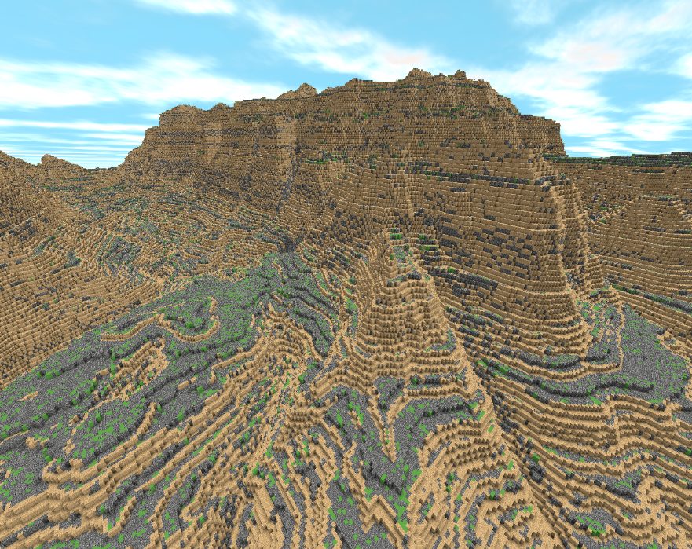
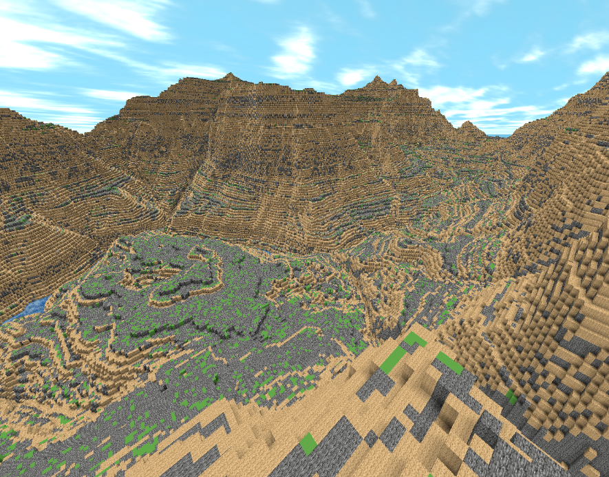
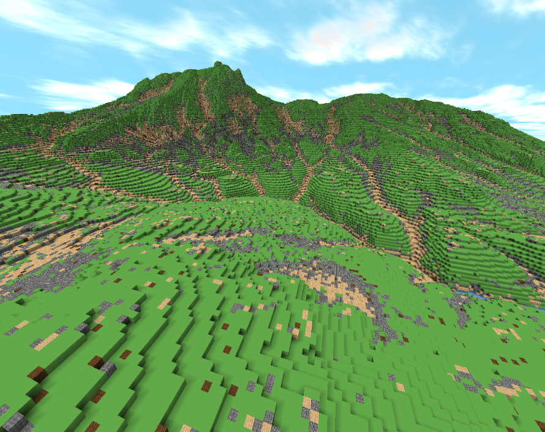

# Oubinity Voxel Engine

### Overview
Oubinity is a voxel engine that focuses on a terrain rendering.

  |  
:------------------------------------------:|:-------------------------------------------:
  |  

  <div style="display:flex">
    
  </div>

### Build
Build on Windows or Linux using Cmake
```
1. git clone https://github.com/nlins8224/Oubinity.git
2. cd Oubinity
3. cmake .  
4. cmake  --build .  --config Release
5. Navigate to Oubinity/bin
```
You can either run the binary in `Oubinity/bin` or open `Oubinity.sln` and run under Visual Studio on Windows.
If using Visual Studio `Release` or `RelWithDebInfo` is recommended.

### Documentation
An overview of the world generation pipeline, terrain generation, meshing, rendering and core algorithms used is available under [DOCUMENTATION.md](https://github.com/nlins8224/Oubinity/blob/docs_update/DOCUMENTATION.md)