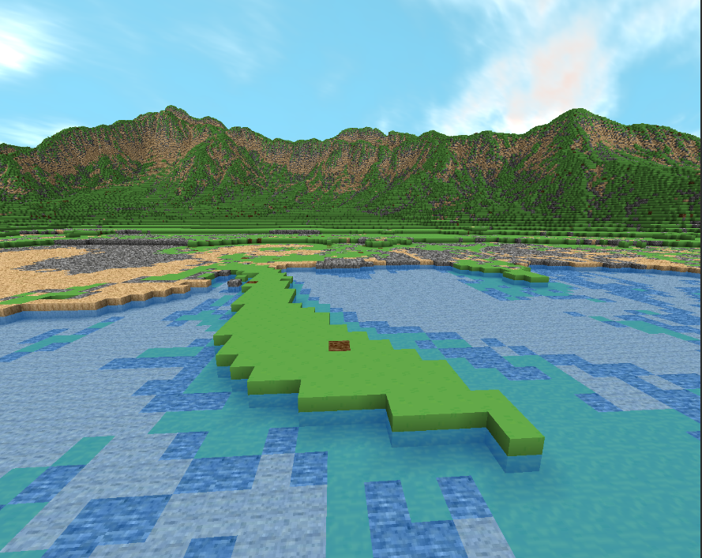

# Oubinity Voxel Engine

### Overview
Oubinity is a voxel engine that focuses on a terrain rendering.

  |  
:------------------------------------------:|:-------------------------------------------:
  |  

  <div style="display:flex">
    
  </div>

### How to build
Build on Linux or Windows using Cmake
```
1. git clone https://github.com/nlins8224/Oubinity.git
2. cmake .  
3. cmake  --build .
4. Navigate to Oubinity/bin
```
Visual studio

### Documentation
An overview of the world generation pipeline, terrain generation, meshing, rendering and core algorithms used is available under [DOCUMENTATION.md](https://github.com/nlins8224/Oubinity/blob/docs_update/DOCUMENTATION.md)